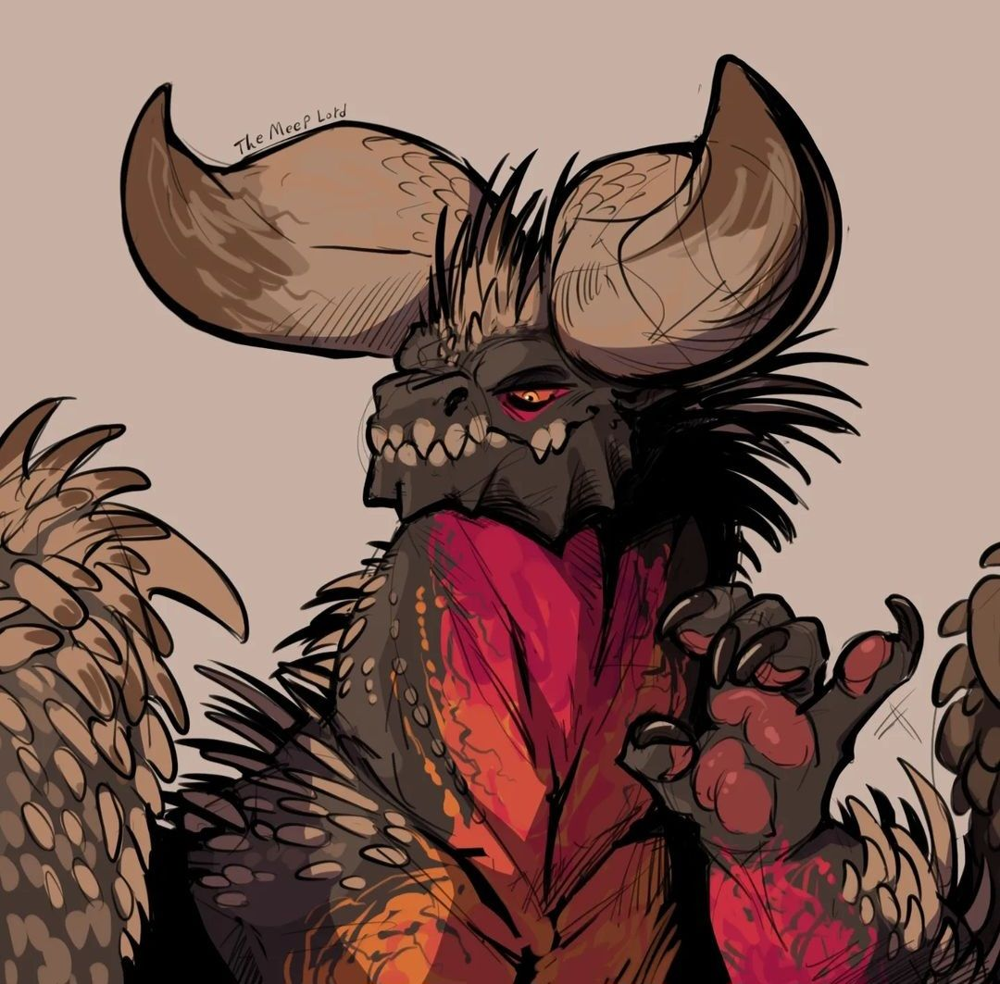

#+title: No se como llamar esto xP
#+author:    Oshiro Arika
#+email:     orihsoarika@gmail.com
#+html_head:  <link rel="stylesheet" type="text/css" href="style.css"/>

* hola :>
esto es una prueba
#+begin_src rust
fn main() -> Result<(), String> {
   println!("Hello World!")
   Ok(())
}
#+end_src

* Imagenes :D
#+ATTR_ORG: :width 600
#+ATTR_HTML: :width 600
#+ATTR_HTML: :class images

